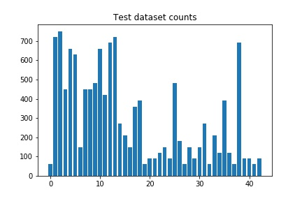
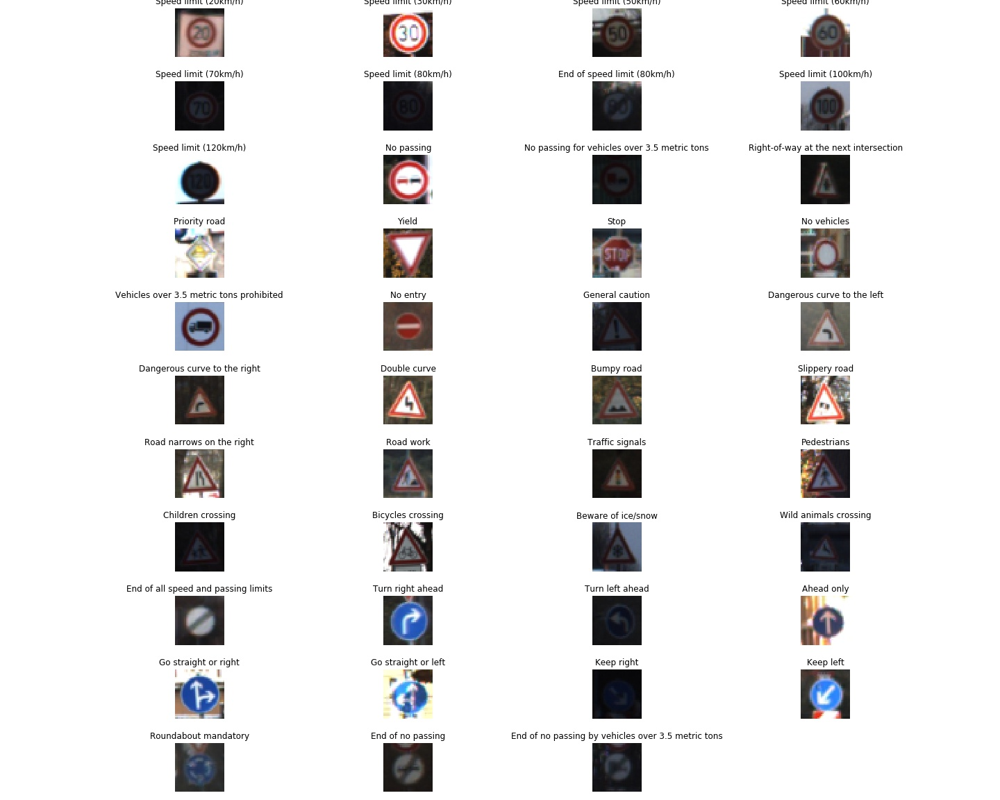

# **Traffic Sign Recognition** 

## Writeup

### You can use this file as a template for your writeup if you want to submit it as a markdown file, but feel free to use some other method and submit a pdf if you prefer.

---

**Build a Traffic Sign Recognition Project**

The goals / steps of this project are the following:
* Load the data set (see below for links to the project data set)
* Explore, summarize and visualize the data set
* Design, train and test a model architecture
* Use the model to make predictions on new images
* Analyze the softmax probabilities of the new images
* Summarize the results with a written report

[//]: # (Image References)

[image1]: ./examples/visualization.jpg "Visualization"
[image2]: ./examples/grayscale.jpg "Grayscaling"
[image3]: ./examples/random_noise.jpg "Random Noise"
[image4]: ./examples/placeholder.png "Traffic Sign 1"
[image5]: ./examples/placeholder.png "Traffic Sign 2"
[image6]: ./examples/placeholder.png "Traffic Sign 3"
[image7]: ./examples/placeholder.png "Traffic Sign 4"
[image8]: ./examples/placeholder.png "Traffic Sign 5"

## Rubric Points
### Here I will consider the [rubric points](https://review.udacity.com/#!/rubrics/481/view) individually and describe how I addressed each point in my implementation.  

---
### Writeup / README

#### 1. Provide a Writeup / README that includes all the rubric points and how you addressed each one. You can submit your writeup as markdown or pdf. You can use this template as a guide for writing the report. The submission includes the project code.

You're reading it! and here is a link to my [project code](https://github.com/udacity/CarND-Traffic-Sign-Classifier-Project/blob/master/Traffic_Sign_Classifier.ipynb)

There are additional two HTM files of the code that were tested but it is not the final one. Only Traffic_Sign_Classifier.HTML is the file to be considered for review purpose.

### Data Set Summary & Exploration

#### 1. Provide a basic summary of the data set. In the code, the analysis should be done using python, numpy and/or pandas methods rather than hardcoding results manually.

I used the pandas library to calculate summary statistics of the traffic
signs data set:

* The size of training set is 34799
* The size of the validation set is 4410
* The size of test set is 12630
* The shape of a traffic sign image is (32, 32, 3)
* The number of unique classes/labels in the data set is 43

#### 2. Include an exploratory visualization of the dataset.

Here is an exploratory visualization of the data set. It is a bar chart showing how the data set of training, test and validation are distirbuted. For plotting unique labels are considered for all the three data sets.

Also, the German Traffic Signs Dataset using the pickled file were also plotted for those unique labels. The image of the signs with names can be found here:

### Design and Test a Model Architecture

#### 1. Describe how you preprocessed the image data. What techniques were chosen and why did you choose these techniques? Consider including images showing the output of each preprocessing technique. Pre-processing refers to techniques such as converting to grayscale, normalization, etc. (OPTIONAL: As described in the "Stand Out Suggestions" part of the rubric, if you generated additional data for training, describe why you decided to generate additional data, how you generated the data, and provide example images of the additional data. Then describe the characteristics of the augmented training set like number of images in the set, number of images for each class, etc.)

As a first step, I decided to convert the images to grayscale because during the course it was learnt for the convoultion netowrk it is better to consdier the grayscale in order to avoid the failure of training data which is unknown. Also, the number of dataset consdiered to be is low compared to color images as we need to know all the possible colors.

Here is an example of a traffic sign image before and after grayscaling.

As a last step, I normalized the image using the formule as mentioned in the given .iypnb comment i.e.. (pixel - 128)/ 128 which converts the int values of each pixel [0,255] to float values with range [-1,1]. The image after processing with grayscaling and normalization along with original traffic sign can be found here:

#### 2. Describe what your final model architecture looks like including model type, layers, layer sizes, connectivity, etc.) Consider including a diagram and/or table describing the final model.

I used the LeNet model that was learnt from the course and changed the parameters. It consiss of 5 layers and the information model with layers is provided below.

My final model consisted of the following layers:

| Layer         		|     Description	        					| 
|:---------------------:|:---------------------------------------------:| 
| Input         		| 32x32x1 Gray image   							| 
| Convolution 5x5     	| 1x1 stride, valid padding, output  28x28x6 	|
| RELU					| Actiavtion applied for layer 1(conv1)	        |
| Max pooling	      	| 2x2 stride, valid padding, output 14x14x6	    |
| Convolution 5x5	    | 1x1 stride, valid padding, output  10x10x16  	|
| RELU		            | Actiavtion applied for layer 2(conv2)         |
| Max pooling	      	| 2x2 stride, valid padding, output 5x5x16	    |
| Flatten	      	    | keep 100%, output = 400                       |
| Fully connected		| Input = 400, output =120                      |
| Flatten	      	    | keep 100%, output = 120                       |
| Fully connected		| Input = 120, output =84                       |
| Flatten	      	    | keep 100%, output = 84                        |
| Fully connected		| Input = 84, output =43                        |

#### 3. Describe how you trained your model. The discussion can include the type of optimizer, the batch size, number of epochs and any hyperparameters such as learning rate.

To train the model, I used the code from course project LeNet with slight modifcation for layer size as mentioned above. Adam optimizer with learning arte of 0.001 is used. Also, I have splited the training dataset using the function "train_test_split" to consider the validation dataset split is done with the ratio of  0.2 as suggested in the end of course.

Paramaters information used to train model are specified below:

| Parameter Name        |     Parameter value	        		| 
|:---------------------:|:-----------------------------------------------:| 
| EPOCHS                |     25	        		| 
| Batch Size            |     128	        		| 
| keep_prob             |     1        		        |
| mu                    |     0	        		    | 
| sigma                 |     0.1        		    | 

#### 4. Describe the approach taken for finding a solution and getting the validation set accuracy to be at least 0.93. Include in the discussion the results on the training, validation and test sets and where in the code these were calculated. Your approach may have been an iterative process, in which case, outline the steps you took to get to the final solution and why you chose those steps. Perhaps your solution involved an already well known implementation or architecture. In this case, discuss why you think the architecture is suitable for the current problem.

My final model results were:
* training set accuracy of : 99.892 %
* validation set accuracy of : 98.420 %
* test set accuracy of :  91.465 %

If a well known architecture was chosen:
* What architecture was chosen : LeNet architecture learnt from the course itself was used. It was good enough for this project as the aim of project was to identify the symbol signs.

* Why did you believe it would be relevant to the traffic sign application? IOne of the reason is its simplest apparoach and as mentioned above LeNet does pretty good classification for symbols 
* How does the final model's accuracy on the training, validation and test set provide evidence that the model is working well? Validation set accuracy obtained for the trained model is lesser than the traning data which indicates model is underfitting. However, the margin is not too much so  trained model is quite good. Of course this could improved by still adjusting the parameters and also with few more pre-processing techniques.
 

### Test a Model on New Images

#### 1. Choose five German traffic signs found on the web and provide them in the report. For each image, discuss what quality or qualities might be difficult to classify.

Here are five German traffic signs that I found on the web, resized all to make it equal.  

#### 2. Discuss the model's predictions on these new traffic signs and compare the results to predicting on the test set. At a minimum, discuss what the predictions were, the accuracy on these new predictions, and compare the accuracy to the accuracy on the test set (OPTIONAL: Discuss the results in more detail as described in the "Stand Out Suggestions" part of the rubric).

Here the results of the prediction is(copied from the printed result of code) :

 Original:Input_images\caution.png --- Prediction: 18

 Original:Input_images\Go_straight_or_left.png --- Prediction: 37

 Original:Input_images\Priority_Road.png --- Prediction: 12

 Original:Input_images\Right_of_way_at_the_next_intersection.png --- Prediction: 11

 Original:Input_images\Speed_limit_30.png --- Prediction: 2

The visualization can be found below with softmax probability.

The model was able to correctly guess 5 of the 5 traffic signs, which gives an accuracy of 100%. The predicted image result corresponds to the indices of sign name in the signnames.csv. This was also verified. I struggeld a bit to get the names printed but somehow ended up in issue so i let it liked that as it has no much impact with predicted result except a better visualization

#### 3. Describe how certain the model is when predicting on each of the five new images by looking at the softmax probabilities for each prediction. Provide the top 5 softmax probabilities for each image along with the sign type of each probability. (OPTIONAL: as described in the "Stand Out Suggestions" part of the rubric, visualizations can also be provided such as bar charts)

The visulaization of top 5 softmax probabilities for each image along with the sign type of each probability is provided here.

The visualization of softmax probalities for each image as bar chart can be found here.

### (Optional) Visualizing the Neural Network (See Step 4 of the Ipython notebook for more details)
#### 1. Discuss the visual output of your trained network's feature maps. What characteristics did the neural network use to make classifications?

I have consdiered the hidden layers of 1 and 2 with actiavtion and maximum pooling respectively. The visualization of the same can be found the in the last section of notebook(.ipynb) file.

